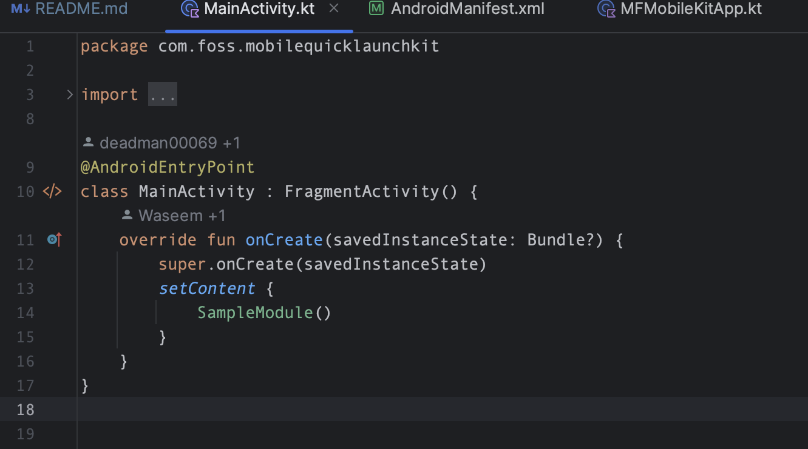

### HILT Setup:

To integrate Hilt into your Android application, follow these steps:

1. **Create a Kotlin File:**

   Create a new Kotlin file in your main app module, naming it `MFMobileKitApp` (or any other
   preferred name).

    ```kotlin
    // MFMobileKitApp.kt

    import android.app.Application
    import dagger.hilt.android.HiltAndroidApp
    import timber.log.Timber

    @HiltAndroidApp
    class MFMobileKitApp : Application() {

        override fun onCreate() {
            super.onCreate()

            // Initialize logging only in debug builds
            if (Timber.treeCount == 0 && BuildConfig.DEBUG) {
                Timber.plant(Timber.DebugTree())
            }
        }
    }
    ```

2. **Add hilt plugin :**

   Update your app level `build.gradle` file with the following:

   ```gradle
   plugins {
   id("com.android.application")
   id("org.jetbrains.kotlin.android")
   id("com.google.dagger.hilt.android")
   kotlin("kapt")
   }
   
   kapt {
      correctErrorTypes = true
   }
   
   dependencies {
   implementation("com.google.dagger:hilt-android:<Version>")
   kapt("com.google.dagger:hilt-compiler:<Version>")
   }
      
   ````

3. **Modify Android Manifest:**

   Go to your main app's `AndroidManifest.xml` file and inside the `<application>` tag, add the
   following line to specify the application class:

    ```xml
    android:name=".MFMobileKitApp"
    ```

   

4. **Add `@AndroidEntryPoint`:**

   In your `MainActivity.kt` file, add the `@AndroidEntryPoint` annotation to enable Hilt for this
   activity.

    ```kotlin
    import dagger.hilt.android.AndroidEntryPoint

    @AndroidEntryPoint
    class MainActivity : AppCompatActivity() {
        // Your activity code here
    }
    ```

   

These steps will configure Hilt in your Android application, enabling dependency injection with
ease.
